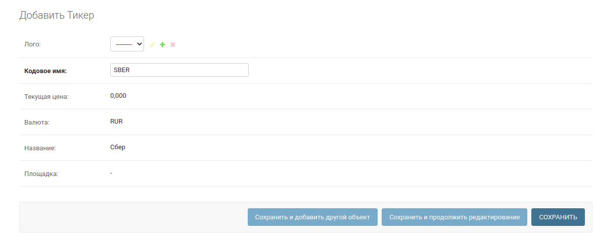
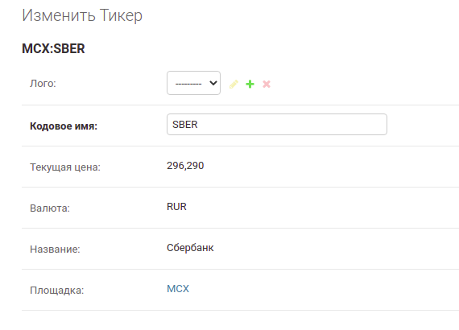
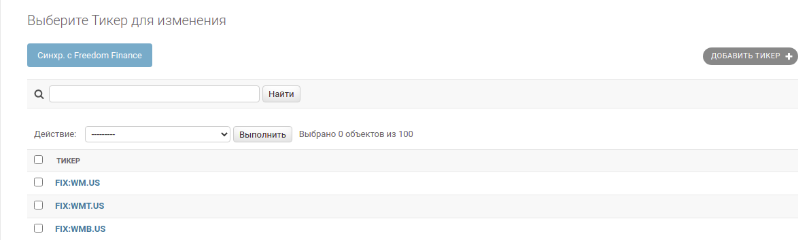
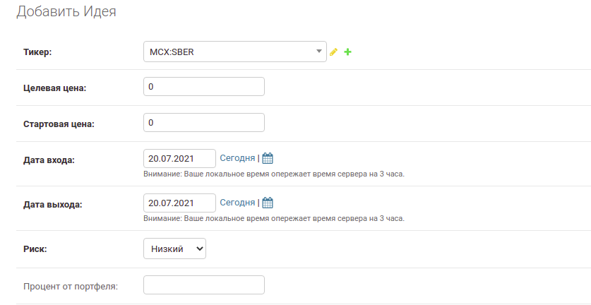
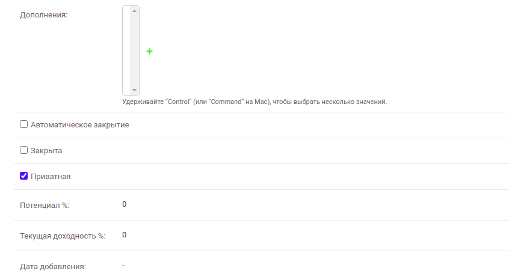
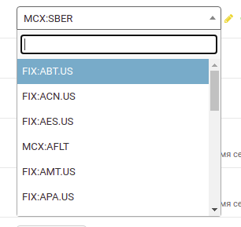

Наполнение контентом
====================

Тикеры
-------

Добавление тикера
^^^^^^^^^^^^^^^^^
Переходим на страницу `создания тикера <https://mwrk.ru/admin/core/ticker/add/>`_

К заполнению доступны 2 поля - *Лого* и *Кодовое имя*.
Все остальные подтянутся автоматически (цена, валюта, название, площадка).
Обязательное поле к заполнению только *Кодовое имя*. Ориентируясь на него, мы сможем получать актуальные данные с Freedom Finace.

.. caution:: 
    Кодовое имя должно быть уникальным в рамках уже созданных на нашей стороне тикеров. В противном случае тикер не создастся

Вводим к примеру "SBER" и нажимаем ``Сохранить``
Если тикер есть у Freedom, то появится и у нас:

Поле *Лого* устанавливаем сами

Массовая синхронизация тикеров с Freedom Finace
^^^^^^^^^^^^^^^^^^^^^^^^^^^^^^^^^^^^^^^^^^^^^^^^^^^^^^^
.. note::
    В самом Freedom Finance имееются данные более чем 1.5M тикеров. 
    Выкачивать их все не целособразно, поэтому для старта можно получить только самые популярные по их версии, не прибегая к ручному наполнению.

Переходим в раздел  `Тикеры <https://mwrk.ru/admin/core/ticker/>`_

Жмем на ``Синхр. с  Freedom Finance`` сверху на панели. Автоматически подтянутся около 300 тикеров.

.. note::
    Сама функция не несет большого сакрального смысла, это может пригодится при стартовом разворачивании проекта - когда нужно получить много нужных нам тикеров.
    Список кодовых имен тикеров можно сформировать отдельно, не опираясь на данные Freedom Finance

Идеи
----
Создание идеи
^^^^^^^^^^^^^

Переходим на `страницу создания идеи <https://mwrk.ru/admin/core/ticker/>`_

Обязательные к заполнению поля *выделены жирным*.

*Связываем идею с тикером* через выпадающий список поля *Тикер*.
С помощью этого меню можно найти нужный тикер либо по кодовому имени (SBER ex), либо по названию (Сбербанк ex):

Заполнив - нажимаем ``Сохранить``.

.. note::
    Поля *Потенциал* и *Текущая доходность* высчитываются автоматически после сохранения, основываясь на значении "Текущая цена" тикера, а также "Целевая цена" и "Стартовая цена" самой идеи

.. note::
    Чек-бокс напротив *Автоматическое закрытие* заставит идею перейти в статус "Закрыта" в день, указанный в поле "Дата выхода"

.. note::
    Чек-бокс напротив *Приватная* скроет идею от публичного просмотра, став доступной только обладателям подписки.
    Если чек-бокс не стоит - идея доступна всем