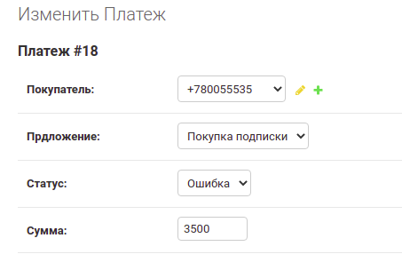

Платежи
=======

Тариф
-----

Устанавливаем тариф
^^^^^^^^^^^^^^^^^^^

Переходим в настройку `тарифа <https://mwrk.ru/admin/accounts/tariff/>`_

.. image:: _static/payments/tariff.png

Название ни на что не влияет, а **цена определяет ежемесячный платеж** в рублевом эквиваленте

.. note::
    Цена меняется только в свежесозданных инвойсах  на оплату.
    Все старые остаются с предыдущей ценой

.. note::
    Настройка существует в единственном экземпляре

Сущность платежа
^^^^^^^^^^^^^^^^^
`Страница для мониторинга транзакций  <https://mwrk.ru/admin/merchant/payment/>`_

Платеж может находится в трех состояниях:
 - Запрос
 - Успех
 - Ошибка

.. caution::
    Руками менять значения не рекомендуется

Алгоритм оплаты
^^^^^^^^^^^^^^^^

.. mermaid::

    graph TD
        A[Запрос оплаты] --> B{Есть инвойсы?};
        B -- Да --> C{Оплатить?};
        B -- Нет --> LU[Создаем инвойс в статусе Запрос]
        LU --> C;
        C -- Да --> D[Вбив карты];
        C -- Нет --> G[Удаляем инвойс];
        D --> S{Успешно?};
        S -- Да --> U[Статус Успех]
        S -- Нет --> I[Статус Ошибка]
        U --> F[Редирект в ЛК]
        I --> F

