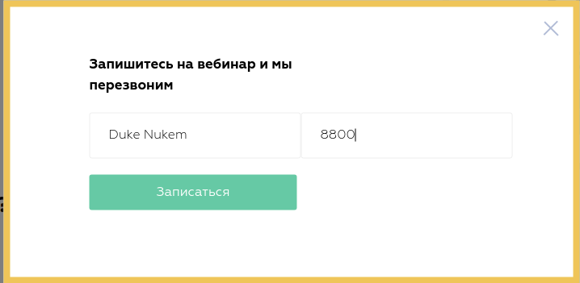
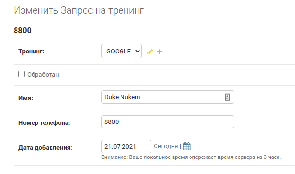
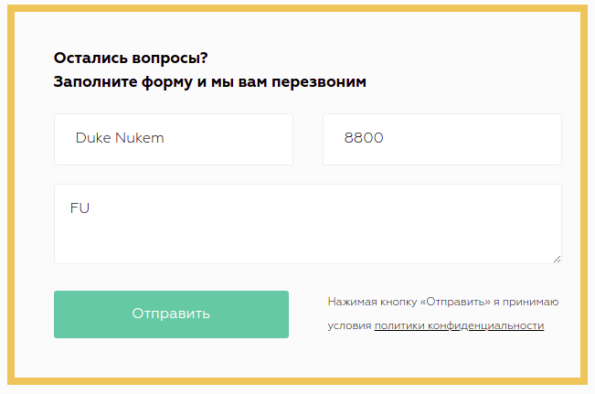
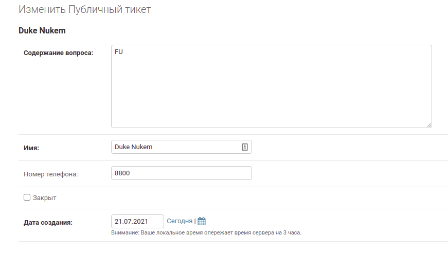
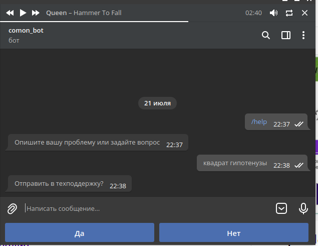
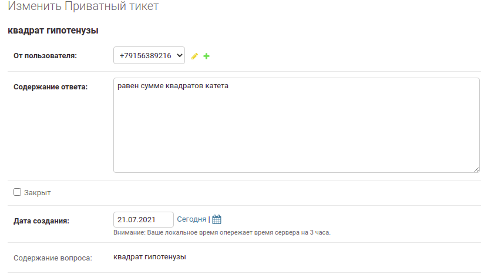
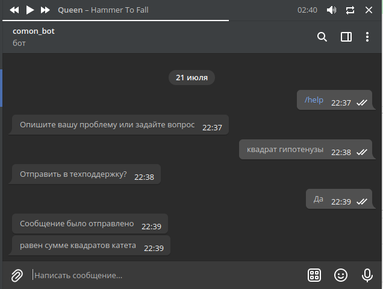
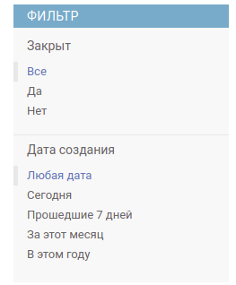

Тех-поддержка
=============

`Раздел тех-поддержки в административной панели <https://mwrk.ru/admin/support/>`_

Сущности
---------
Есть три сущности, связанных с работой тех-поддержки:

Запрос на тренинг
^^^^^^^^^^^^^^^^^
К этим запросам относятся данные, поступившие через форму на странице вебинара:

Запись в админке:

Публичный тикет
^^^^^^^^^^^^^^^^^
К этим запросам относятся данные, поступившие через форму обратной связи на странице Контакты и модальное окно Идеи:

Запись в админке:

Приватный тикет
^^^^^^^^^^^^^^^^^

.. note::
    На приватные тикеты есть возможность отвечать пользователю из админки, транслируя ответы через бота

К этим запросам относятся данные, поступившие через телеграм-бота от конкретного пользователя:

Запись в админке:

Поле **"Содержание ответа"** доступно для заполнения в отличие от "Содержание вопроса".

Набрав в него текст и нажав на кнопку ``Отправить в телеграм``, сообщение дойдет до нужного пользователя:

Элементы интерфейса
--------------------

На каждый раздел прилагаются фильтры:

